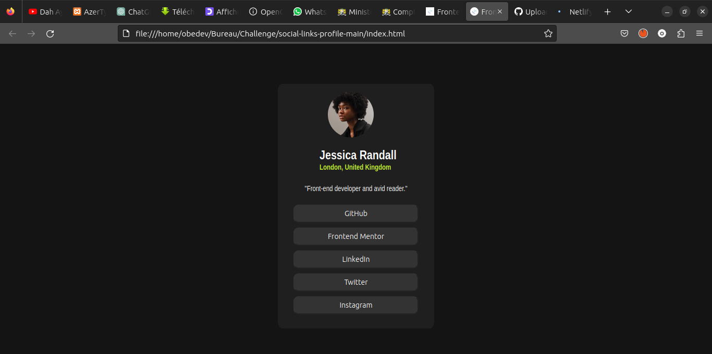

# Frontend Mentor - Profile card component solution

This is a solution to the [Profile card component challenge on Frontend Mentor](https://www.frontendmentor.io/challenges/profile-card-component-cfArpWshJ). Frontend Mentor challenges help you improve your coding skills by building realistic projects. 

## Table of contents

- [Overview](#overview)
  - [Screenshot](#screenshot)
  - [Links](#links)
- [Author](#author)
- [Acknowledgments](#acknowledgments)

## Overview

### Screenshot Desktop

### Screenshot Mobile

### Links

- Solution URL: [Add solution URL here](https://github.com/Obed67/Profile-card-component-solution/tree/main)
- Live Site URL: [Add live site URL here](https://profile-card-component-solution-obed.netlify.app/)

## My process

### Built with

- Semantic HTML5 markup
- CSS custom properties
- Bootstrap

## Author

- Website - [Obed AGBOHOUN](https://www.your-site.com)
- Linkdin - [Obed AGBOHOUN](https://www.linkedin.com/in/sonagnon-obed-agbohoun-a1b500262/?lipi=urn%3Ali%3Apage%3Ad_flagship3_feed%3BcNpVddBcQ8iarGQE7ez0Og%3D%3D)
- Twitter - [@s_sonagnon](https://www.twitter.com/s_sonagnon)

## Acknowledgments

This is where you can give a hat tip to anyone who helped you out on this project. Perhaps you worked in a team or got some inspiration from someone else's solution. This is the perfect place to give them some credit.